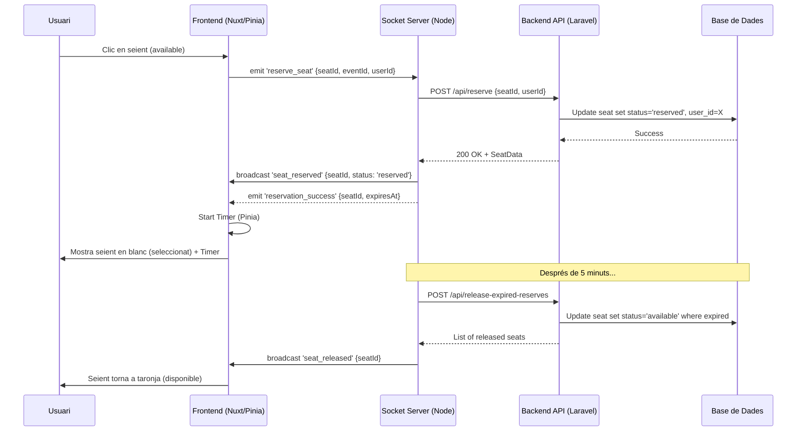

# Sequence Diagram: Real-Time Seat Reservation

```mermaid
sequenceDiagram
    participant U as Usuari
    participant F as Frontend (Nuxt/Pinia)
    participant S as Socket Server (Node)
    participant B as Backend API (Laravel)
    participant D as Base de Dades

    U->>F: Clic en seient (available)
    F->>S: emit 'reserve_seat' {seatId, eventId, userId}
    S->>B: POST /api/reserve {seatId, userId}
    B->>D: Update seat set status='reserved', user_id=X
    D-->>B: Success
    B-->>S: 200 OK + SeatData
    S->>F: broadcast 'seat_reserved' {seatId, status: 'reserved'}
    S-->>F: emit 'reservation_success' {seatId, expiresAt}
    F->>F: Start Timer (Pinia)
    F->>U: Mostra seient en blanc (seleccionat) + Timer
    
    Note over S,D: Després de 5 minuts...
    S->>B: POST /api/release-expired-reserves
    B->>D: Update seat set status='available' where expired
    B-->>S: List of released seats
    S->>F: broadcast 'seat_released' {seatId}
    F->>U: Seient torna a taronja (disponible)
```
