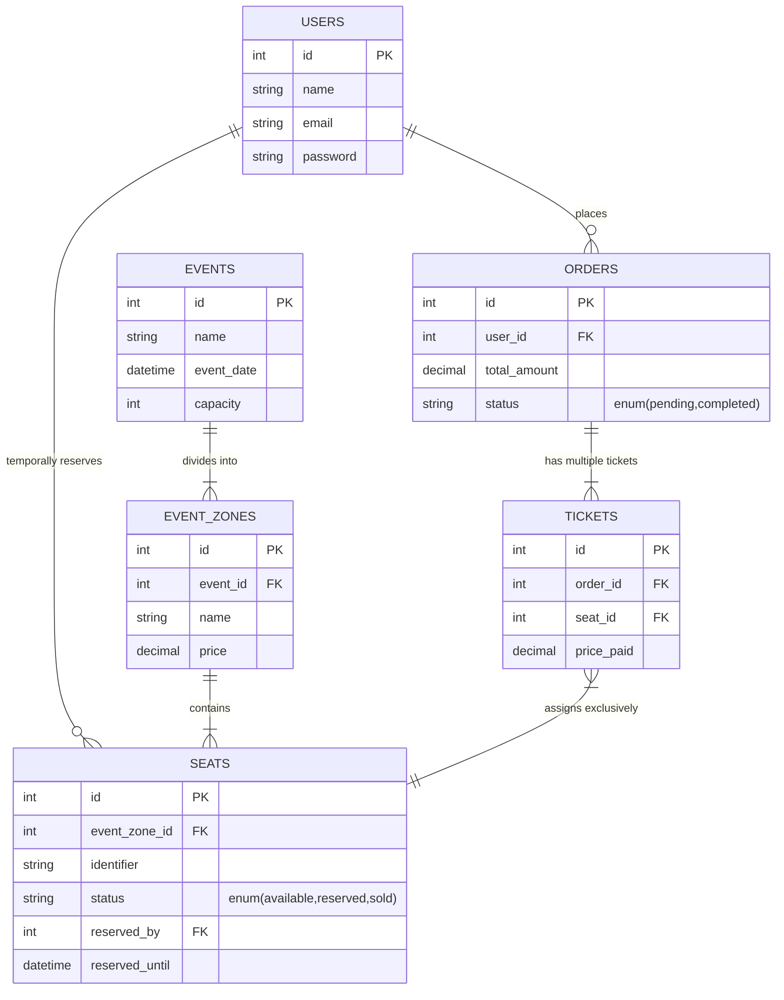

# Diagrama Entitat-Relació

Pots visualitzar aquest diagrama en eines que suportin format Mermaid (com el GitHub preview o aplicacions Markdown).

```mermaid
erDiagram
    USERS ||--o{ SEATS : "temporally reserves"
    USERS ||--o{ ORDERS : "places"
    EVENTS ||--|{ EVENT_ZONES : "divides into"
    EVENT_ZONES ||--|{ SEATS : "contains"
    ORDERS ||--|{ TICKETS : "has multiple tickets"
    TICKETS }|--|| SEATS : "assigns exclusively"

    USERS {
        int id PK
        string name
        string email
        string password
    }
    EVENTS {
        int id PK
        string name
        datetime event_date
        int capacity
    }
    EVENT_ZONES {
        int id PK
        int event_id FK
        string name
        decimal price
    }
    SEATS {
        int id PK
        int event_zone_id FK
        string identifier
        string status "enum(available,reserved,sold)"
        int reserved_by FK
        datetime reserved_until
    }
    ORDERS {
        int id PK
        int user_id FK
        decimal total_amount
        string status "enum(pending,completed)"
    }
    TICKETS {
        int id PK
        int order_id FK
        int seat_id FK
        decimal price_paid
    }
```
