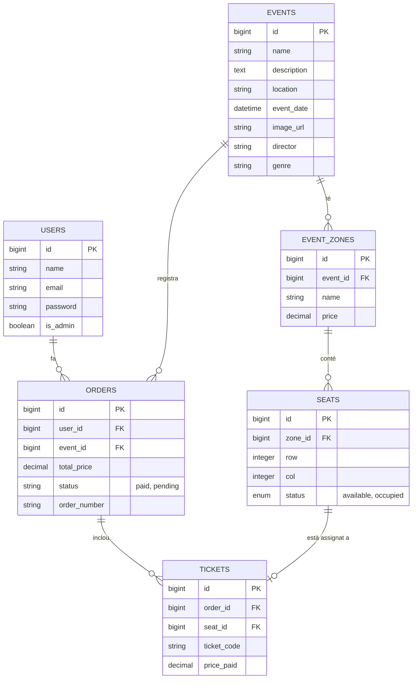
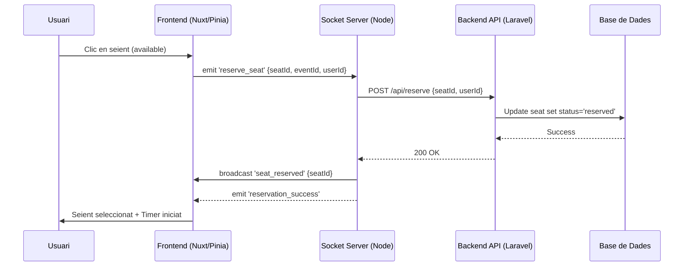

# Project Diagrams - Shôko Cinema

## Entity-Relationship Diagram (ERD)
Aquest diagrama mostra l'estructura de la base de dades i les relacions entre les entitats.

## Sequence Diagram: Real-Time Reservation
Flux de treball de Socket.IO per a la sincronització de concurrència.

